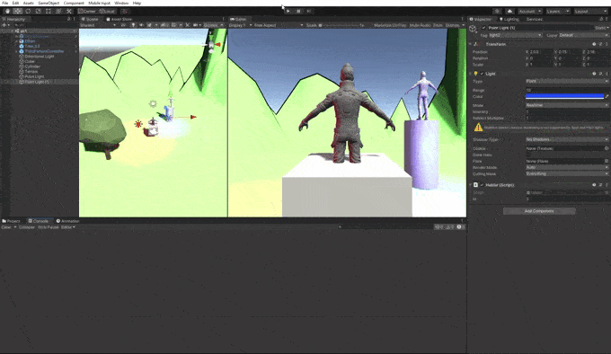

# II_pr1

- Se han incluido 2 objetos 3D básicos (un cubo y un cilindro)
- Se ha incluido el objeto "Ethan" del Standard Assets (el que está encima del cilindro)
- Se ha incluido un árbol de otro paquete de Assets (https://assetstore.unity.com/packages/3d/environments/landscapes/low-poly-simple-nature-pack-162153)
- Se ha creado un terreno, al cual se le ha puesto una textura que se encontraba en el paquete de Standard Assets
- La escena tiene dos fuentes de luz, una roja y una azul. Las dos son luces de tipo Point.
- Se ha utilizado el prefab de Third Person, el cual usa un modelo del personaje Ethan y unas animacion hechas para este. Se añadió la camara de la escena como hija de este prefab, para conseguir que la camara siga al personaje cuando este se mueva. 
- Se ha agregado un script el cual en el método Start escribe en consola el nombre del objeto y su identificador (este identificador es una variable pública a la que se le da un valor en el inspector). En el método Update se volverá a escribir la misma información pero agregandóle un contador que va aumentando en cada iteración. 

  
